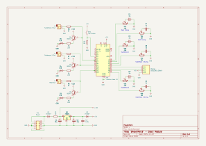
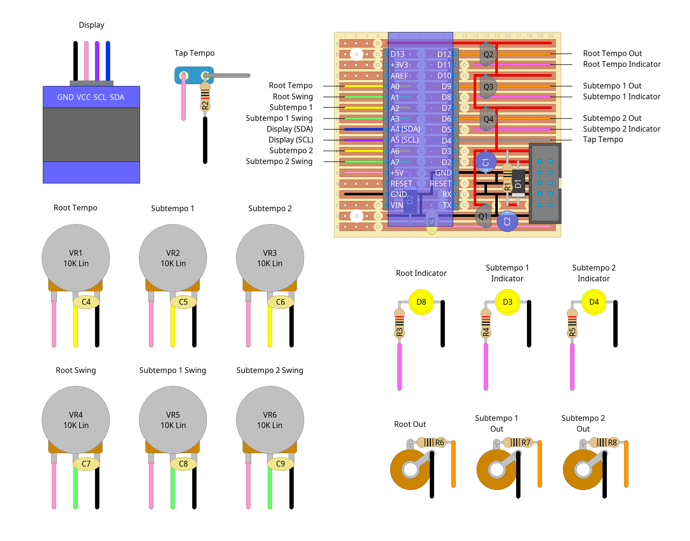

# "showtime !!" - arduino-based clock module

## description

clock module originally inspired by [dawn synths' clock module](https://www.youtube.com/watch?v=3HPdFuuat7c), but it kinda ended up way more complicated. has the following features:

- root tempo and 2 subtempos, each with independent swing control
- tap tempo
- "hold" mode for instant jumps in bpm
- 5v output for compatibility with external devices (ie. my sequencer and volca sample)
- oled display showing current values for bpm, subtempo, swing, tap tempo state and more(?)

this is the first time i've ever really done anything with an arduino so the power circuitry is kinda goofy. i was having real trouble getting it to run off external power so i just looked at how the board handles usb power and copied that, piping it straight into the +5v pin. it works, but for some reason the specific component that made it work seems to be the diode, and i'm not really sure why (maybe reverse current issues?) anyway, the arduino docs recommend strongly against powering it via the +5v pin, but it should be fine as long as you don't give it usb and synth power at the same time lol

also, the code is also kind of a mess cos i've not programmed c++ in most of a decade at this point. can't say i missed it! trying to keep the code clean was an absolute nightmare... it'll be some time before i make another arduino-powered module i think

other notes:

- you might wanna use a beefier regulator like an l7805, but the current draw was hovering around ~20mA so the 78l05 seems to handle it just fine. plus it's what i got in stock so i just went for it
- the clock signal comes out a little cold, ~4.2v. i think this is due to the forward voltage drop of the 1n4007 after the 5v regulator? not really sure how to improve it...
- output buffers shouldn't be necessary but i've left enough free space by the transistors to socket a tl074 (although hooking it up would involve some deadbugging). just don't accidentally plug any eurorack outputs into the clock outputs and it'll be fine ;)
- i've used 220Ω resistors for the leds to match the brightness of leds on my other modules - if you're not using ultra-bright yellow leds, adapt the values!

## schematics

### circuit diagram

### stripboard layout

### bill of materials
<table cellspacing="0" border="1">
  <tr>
    <th>Name</th>
    <th>Value</th>
    <th>Quantity</th>
    <th>Notes</th>
  </tr>
  <tr>
    <td>MC</td>
    <td>arduino nano</td>
    <td>1</td>
    <td>or compatible clone lol</td>
  </tr>
  <tr>
    <td>OLED Display</td>
    <td>ssd1306 128x64 (i2c)</td>
    <td>1</td>
    <td>mine's "GM009605v4.3"(?)</td>
  </tr>
  <tr>
    <td>Vero Board</td>
    <td>20 columns x 18 rows (strips)</td>
    <td>1</td>
    <td></td>
  </tr>
  <tr>
    <td>C1, C2</td>
    <td>10uF 50V electrolytic capacitors</td>
    <td>2</td>
    <td></td>
  </tr>
  <tr>
    <td>C3</td>
    <td>0.1uF 50V ceramic capacitor</td>
    <td>1</td>
    <td></td>
  </tr>
  <tr>
    <td>C4, C5, C6, C7, C8, C9</td>
    <td>1uF 50V ceramic capacitors</td>
    <td>6</td>
    <td></td>
  </tr>
  <tr>
    <td>D1, D2</td>
    <td>1N4007 rectifier diodes</td>
    <td>2</td>
    <td></td>
  </tr>
  <tr>
    <td>D3, D4, D5</td>
    <td>LED</td>
    <td>3</td>
    <td>i used yellow :)</td>
  </tr>
  <tr>
    <td>J1, J2, J3</td>
    <td>3.5mm mono jack sockets</td>
    <td>3</td>
    <td></td>
  </tr>
  <tr>
    <td>PH1</td>
    <td>10 pin IDC socket</td>
    <td>1</td>
    <td></td>
  </tr>
  <tr>
    <td>PH2, PH3</td>
    <td>2.54mm pin sockets (15 x 1)</td>
    <td>2</td>
    <td></td>
  </tr>
  <tr>
    <td>PH4</td>
    <td>2.54mm pin sockets (4 x 1)</td>
    <td>1</td>
    <td>for the display (optional)</td>
  </tr>
  <tr>
    <td>Q1</td>
    <td>78L05 5V linear regulator</td>
    <td>1</td>
    <td></td>
  </tr>
  <tr>
    <td>Q2, Q3, Q4</td>
    <td>BC547 general purpose transistors</td>
    <td>3</td>
    <td>BC548 probably works too</td>
  </tr>
  <tr>
    <td>R1</td>
    <td>10Ω 0.25W resistor</td>
    <td>1</td>
    <td></td>
  </tr>
  <tr>
    <td>R2</td>
    <td>10K 0.25W resistor</td>
    <td>1</td>
    <td></td>
  </tr>
  <tr>
    <td>R3, R4, R5</td>
    <td>220Ω 0.25W resistors</td>
    <td>3</td>
    <td></td>
  </tr>
  <tr>
    <td>R6, R7, R8</td>
    <td>1K 0.25W resistors</td>
    <td>3</td>
    <td></td>
  </tr>
  <tr>
    <td>SW1</td>
    <td>spst (on/off) toggle switch</td>
    <td>1</td>
    <td>ideally an arcade button</td>
  </tr>
  <tr>
    <td>VR1, VR2, VR3, VR4, VR5, VR6</td>
    <td>10K linear potentiometers</td>
    <td>6</td>
    <td></td>
  </tr>
</table>
