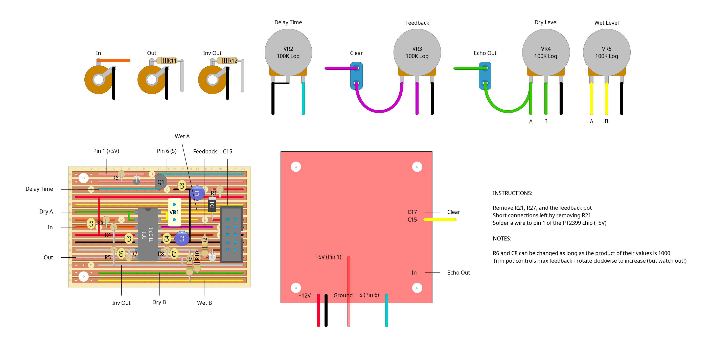

# "death rattle" - dirty pt2399-based delay module

## description

a gritty pt2399-based digital delay module.

the core of this thing is one of those cheap delay modules you can find for like £2 on ebay/aliexpress, but i've modded it to add some extra features:
- delay time control
- wider range of feedback control (watch out!)
- clear feedback button
- bypass/echo out toggle
- wet/dry controls

this is the first module i made (no idea why i started with this of all things) so the design is pretty rough and seems to have some grounding issues? i think they could be fixed by adding pulldown resistors where the "clear" and "echo out" switches (SW1 and SW2 respectively) are wired into the delay chip, but i've not tried it yet.

## schematics

### delay module

### bill of materials

<table cellspacing="0" border="1">
  <tr>
    <th>Name</th>
    <th>Value</th>
    <th>Quantity</th>
    <th>Notes</th>
  </tr>
  <tr>
    <td>Vero Board</td>
    <td>23 columns x 15 rows</td>
    <td>1</td>
    <td></td>
  </tr>
  <tr>
    <td>C1, C2</td>
    <td>100nF 50V ceramic capacitors</td>
    <td>2</td>
    <td></td>
  </tr>
  <tr>
    <td>C3, C4, C5, C8</td>
    <td>1uF 50V ceramic capacitors</td>
    <td>4</td>
    <td></td>
  </tr>
  <tr>
    <td>C6</td>
    <td>22pF 50V ceramic capacitor</td>
    <td>1</td>
    <td></td>
  </tr>
  <tr>
    <td>C7</td>
    <td>10pF 50V ceramic capacitor</td>
    <td>1</td>
    <td></td>
  </tr>
  <tr>
    <td>D1, D2</td>
    <td>1N4007 rectifier diodes</td>
    <td>2</td>
    <td></td>
  </tr>
  <tr>
    <td>D3</td>
    <td>1N4148 signal diodes</td>
    <td>1</td>
    <td></td>
  </tr>
  <tr>
    <td>IC1</td>
    <td>TL074 quad op-amp</td>
    <td>1</td>
    <td></td>
  </tr>
  <tr>
    <td>J1, J2, J3</td>
    <td>3.5mm mono jack sockets</td>
    <td>3</td>
    <td></td>
  </tr>
  <tr>
    <td>PH1</td>
    <td>10 pin IDC socket</td>
    <td>1</td>
    <td></td>
  </tr>
  <tr>
    <td>Q1</td>
    <td>BC337</td>
    <td>1</td>
    <td></td>
  </tr>
  <tr>
    <td>R1, R2</td>
    <td>10Ω 0.25W resistors</td>
    <td>2</td>
    <td></td>
  </tr>
  <tr>
    <td>R3, R5, R7</td>
    <td>100K 0.25W resistors</td>
    <td>3</td>
    <td></td>
  </tr>
  <tr>
    <td>R4</td>
    <td>33K 0.25W resistor</td>
    <td>1</td>
    <td></td>
  </tr>
  <tr>
    <td>R6</td>
    <td>1M 0.25W resistor</td>
    <td>1</td>
    <td></td>
  </tr>
  <tr>
    <td>R8</td>
    <td>200K 0.25W resistor</td>
    <td>1</td>
    <td></td>
  </tr>
  <tr>
    <td>R9, R10</td>
    <td>51K 0.25W resistors</td>
    <td>2</td>
    <td></td>
  </tr>
  <tr>
    <td>R11, R12</td>
    <td>1K 0.25W resistors</td>
    <td>2</td>
    <td></td>
  </tr>
  <tr>
    <td>SW1</td>
    <td>push-to-break momentary switch</td>
    <td>1</td>
    <td></td>
  </tr>
  <tr>
    <td>SW2</td>
    <td>spst on/off toggle switch</td>
    <td>2</td>
    <td></td>
  </tr>
  <tr>
    <td>VR1</td>
    <td>20K linear potentiometer</td>
    <td>1</td>
    <td></td>
  </tr>
  <tr>
    <td>VR2, VR3, VR4, VR5</td>
    <td>100K logarithmic potentiometer</td>
    <td>4</td>
    <td></td>
  </tr>
</table>
