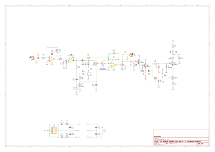
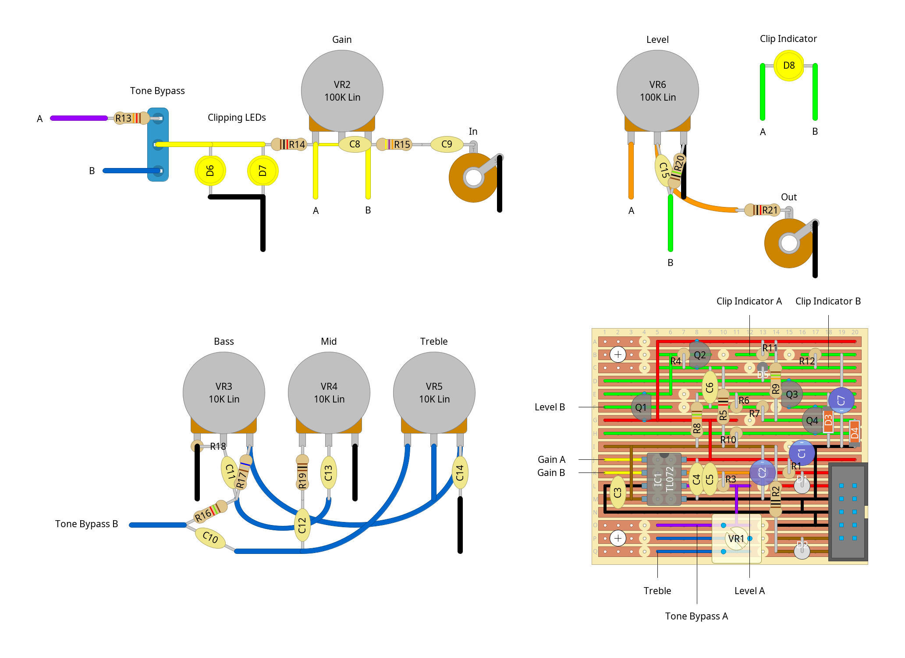

# "the module known only as sir" - distortion module

a distortion module based on marshall's "the guvnor" pedal

this was a pretty interesting one to design. i started out with the schematic as posted at [electrosmash](https://web.archive.org/web/20260516164111/https://electrosmash.com/marshall-guvnor-analysis) (rip ;_;7), stripped out the parts for the loop jack and bypass since they're less useful features for a modular synth imo, then started adapting what was left to work with eurorack power and signal levels. i ended up smushing the gain sections of the input and clipping stages together, since eurorack signals are strong enough already that the original circuit's combined amplification of around 3220x (or ~70db, but that sounds much less scary) would be comical levels of overkill. instead, the new "gain" section just goes up to 2x (6db?), and can also attenuate the signal down to nothing. i moved the op amp that was freed up by this to the output stage instead, using it to make up the voltage lost in the clipping stage. this all meant throwing out the filters present in the original design, but i've tried to recreate them as closely as possble in the new gain and level circuitry.

the amplifier in the output stage is set up to give a gain of ~2.75x, which will bring the signal back up to ~10v p2p when the tone bypass (another addition) is enabled. however, the signal strength when the tone bypass is disabled can vary wildly, so i added a trim pot on that side for adjusting the max gain. it's still possible for the signal to wild out though, so i added a clipping indicator circuit based on [this one](https://leachlegacy.ece.gatech.edu/lowtim/graphics/clip.pdf), which is apparently adapted from an old electronics magazine from the 70s? it took a lot of messing with resistor values to make it work right in this context, but it works pretty well for letting me know when i've cranked it too hard. obviously i could've built a simpler indicator using another op amp instead, but for some reason i'd decided i really wanted to stick to just the single tl072 for this.

i'm really happy with the resulting sound, but something i'd maybe consider if i built this again is dropping c9. it's part of the filtering i added back in to mimic the original, so i ended up leaving it in for accuracy (and cos the tone stack can make bass-heavy signals get WAY out of hand), but when i was breadboarding it i tried dropping that cap and it sounded pretty sick without it, even if the voltages did end up getting unruly as expected. maybe if there's ever a v2 of this module i'll add a jumper for it or something....

## schematics

### circuit diagram

### stripboard layout

### bill of materials
<table cellspacing="0" border="1">
  <tr>
    <th>Name</th>
    <th>Value</th>
    <th>Quantity</th>
    <th>Notes</th>
  </tr>
  <tr>
    <td>Vero Board</td>
    <td>20 columns x 17 rows</td>
    <td>1</td>
    <td></td>
  </tr>
  <tr>
    <td>C1, C2, C7</td>
    <td>10uF 50V electrolytic capacitors</td>
    <td>3</td>
    <td></td>
  </tr>
  <tr>
    <td>C3, C4, C11</td>
    <td>100nF 50V ceramic capacitors</td>
    <td>3</td>
    <td></td>
  </tr>
  <tr>
    <td>C5</td>
    <td>330pF 50V ceramic capacitor</td>
    <td>1</td>
    <td></td>
  </tr>
  <tr>
    <td>C6</td>
    <td>10uF 50V ceramic capacitor</td>
    <td>1</td>
    <td></td>
  </tr>
  <tr>
    <td>C8</td>
    <td>120pF 50V ceramic capacitor</td>
    <td>1</td>
    <td></td>
  </tr>
  <tr>
    <td>C9</td>
    <td>2.2nF 50V ceramic capacitor</td>
    <td>1</td>
    <td></td>
  </tr>
  <tr>
    <td>C10</td>
    <td>4.7nF 50V ceramic capacitor</td>
    <td>1</td>
    <td></td>
  </tr>
  <tr>
    <td>C12</td>
    <td>10nF 50V ceramic capacitor</td>
    <td>1</td>
    <td></td>
  </tr>
  <tr>
    <td>C13</td>
    <td>220nF 50V ceramic capacitor</td>
    <td>1</td>
    <td></td>
  </tr>
  <tr>
    <td>C14</td>
    <td>68nF 50V ceramic capacitor</td>
    <td>1</td>
    <td></td>
  </tr>
  <tr>
    <td>C15</td>
    <td>1uF 50V ceramic capacitor</td>
    <td>1</td>
    <td></td>
  </tr>
  <tr>
    <td>D1, D2</td>
    <td>1N4007 rectifier diodes</td>
    <td>2</td>
    <td></td>
  </tr>
  <tr>
    <td>D3, D4, D5</td>
    <td>1N4148 signal diodes</td>
    <td>3</td>
    <td></td>
  </tr>
  <tr>
    <td>D6, D7, D8</td>
    <td>LEDs</td>
    <td>3</td>
    <td>i used yellow :)</td>
  </tr>
  <tr>
    <td>IC1</td>
    <td>TL074 dual op-amp</td>
    <td>1</td>
    <td></td>
  </tr>
  <tr>
    <td>J1, J2</td>
    <td>3.5mm mono jack sockets</td>
    <td>2</td>
    <td></td>
  </tr>
  <tr>
    <td>PH1</td>
    <td>10 pin IDC socket</td>
    <td>1</td>
    <td></td>
  </tr>
  <tr>
    <td>Q1, Q2, Q3</td>
    <td>BC547 general purpose transistors</td>
    <td>3</td>
    <td></td>
  </tr>
  <tr>
    <td>Q4</td>
    <td>BC557 general purpose transistor</td>
    <td>1</td>
    <td></td>
  </tr>
  <tr>
    <td>R1, R2</td>
    <td>10Ω 0.25W resistors</td>
    <td>2</td>
    <td></td>
  </tr>
  <tr>
    <td>R3</td>
    <td>33K 0.25W resistor</td>
    <td>1</td>
    <td></td>
  </tr>
  <tr>
    <td>R4</td>
    <td>10K 0.25W resistor</td>
    <td>1</td>
    <td></td>
  </tr>
  <tr>
    <td>R5, R14, R21</td>
    <td>1K 0.25W resistors</td>
    <td>3</td>
    <td></td>
  </tr>
  <tr>
    <td>R6, R7</td>
    <td>3.3K 0.25W resistors</td>
    <td>2</td>
    <td></td>
  </tr>
  <tr>
    <td>R8, R9</td>
    <td>15K 0.25W resistors</td>
    <td>2</td>
    <td></td>
  </tr>
  <tr>
    <td>R10, R11, R16</td>
    <td>1.5K 0.25W resistors</td>
    <td>3</td>
    <td></td>
  </tr>
  <tr>
    <td>R12</td>
    <td>220Ω 0.25W resistor</td>
    <td>1</td>
    <td></td>
  </tr>
  <tr>
    <td>R13</td>
    <td>12K 0.25W resistor</td>
    <td>1</td>
    <td></td>
  </tr>
  <tr>
    <td>R15</td>
    <td>47K 0.25W resistor</td>
    <td>1</td>
    <td></td>
  </tr>
  <tr>
    <td>R17, R18</td>
    <td>680Ω 0.25W resistors</td>
    <td>2</td>
    <td></td>
  </tr>
  <tr>
    <td>R19</td>
    <td>100Ω 0.25W resistor</td>
    <td>1</td>
    <td></td>
  </tr>
  <tr>
    <td>R20</td>
    <td>1M 0.25W resistor</td>
    <td>1</td>
    <td></td>
  </tr>
  <tr>
    <td>SW1</td>
    <td>spdt (on/on) toggle switch</td>
    <td>1</td>
    <td></td>
  </tr>
  <tr>
    <td>VR1</td>
    <td>10K linear trim pot</td>
    <td>1</td>
    <td></td>
  </tr>
  <tr>
    <td>VR2, VR6</td>
    <td>100K linear potentiometers</td>
    <td>2</td>
    <td></td>
  </tr>
  <tr>
    <td>VR3, VR4, VR5</td>
    <td>10K linear potentiometers</td>
    <td>3</td>
    <td></td>
  </tr>
</table>
