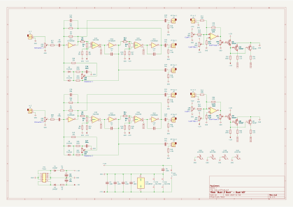
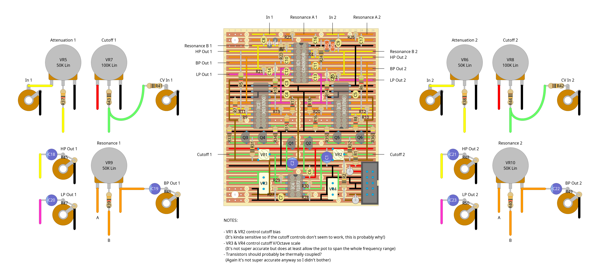

# "buck 2 buck" - dual vcf module

dual vcf module based on the filter section of the [edp wasp](https://en.wikipedia.org/wiki/Electronic_Dream_Plant#Wasp)

i was lookin at vcf designs for a bit and most of em seemed to fall into one of two categories: ones that didn't have the features i wanted and ones that i didn't understand how they worked. this one originally fell into the second category but it did at least seem simple enough that i could build it anyway, and i kinda picked up the gist of how it works along the way

the schematic is largely based on [jurgen haibles' design](https://www.schmitzbits.de/wasp.html), taking notes from the v/oct cv input of the [cgs twin cmos filter](https://sdiy.info/wiki/CGS_twin_CMOS_filter), and as a result the filter part of the circuit runs entirely between ground and the negative rail. i wasn't really vibing with how the notch pass and distortion sounded on the breadboard and realised that without them i'd have enough spare gates for a second vcf, so i decided to drop them entirely and turn this into a dual design instead. at that point it seemed like there was no real reason to mess around with -5v at all and, after seeing [a design which runs directly off 9v](https://electro-music.com/forum/topic-69848.html), i experimented with running it straight off -12v. this seems to work just fine and also has the added bonus of giving a much louder output

overall i'm pretty happy with how this one turned out, it sounds really nice, especially with the resonance driven all the way up (i actually added the input attenuation pots specifically so the signal can be turned down to give the resonance enough room to go wild without clipping). i haven't really bothered tuning the cv inputs to v/oct yet since i'm not really giving it any v/oct signals, but the range seems good. now i just need to build an lfo to plug into it...

other notes:

- the xd13700 chips are clones of the old through-hole lm13700, feel free to use those instead if you have them lying about but i didn't have any and the clones seem functionally identical while also still being in production (and hence significantly cheaper) so.....
- i remember reading somewhere that the cd4069 specifically needs to be the unbuffered variant. i don't remember where i read that or what the reasoning was though,

## schematics

### circuit diagram

### stripboard layout

### bill of materials
<table cellspacing="0" border="1">
  <tr>
    <th>Name</th>
    <th>Value</th>
    <th>Quantity</th>
    <th>Notes</th>
  </tr>
  <tr>
    <td>Vero Board</td>
    <td>26 columns x 30 rows</td>
    <td>1</td>
    <td></td>
  </tr>
  <tr>
    <td>C1, C2, C18, C19, C20, C21, C22, C23</td>
    <td>10uF 50V electrolytic capacitors</td>
    <td>8</td>
    <td></td>
  </tr>
  <tr>
    <td>C3, C4, C5, C6, C7</td>
    <td>100nF 50V ceramic capacitors</td>
    <td>5</td>
    <td></td>
  </tr>
  <tr>
    <td>C8, C9, C16, C17</td>
    <td>220nF 50V ceramic capacitors</td>
    <td>4</td>
    <td></td>
  </tr>
  <tr>
    <td>C10, C11, C12, C13</td>
    <td>1nF 50V ceramic capacitors</td>
    <td>4</td>
    <td></td>
  </tr>
  <tr>
    <td>C14, C15</td>
    <td>68pF 50V ceramic capacitors</td>
    <td>2</td>
    <td></td>
  </tr>
  <tr>
    <td>D1, D2</td>
    <td>1N4007 rectifier diodes</td>
    <td>2</td>
    <td></td>
  </tr>
  <tr>
    <td>D3, D4, D5, D6</td>
    <td>1N4148 signal diodes</td>
    <td>4</td>
    <td></td>
  </tr>
  <tr>
    <td>IC1</td>
    <td>CD4069UB cmos hex inverter</td>
    <td>1</td>
    <td></td>
  </tr>
  <tr>
    <td>IC2, IC3</td>
    <td>XD13700 dual OTA</td>
    <td>2</td>
    <td></td>
  </tr>
  <tr>
    <td>IC4</td>
    <td>TL072 dual op-amp</td>
    <td>1</td>
    <td></td>
  </tr>
  <tr>
    <td>J1, J2, J3, J4, J5, J6, J7, J8, J9, J10</td>
    <td>3.5mm mono jack sockets</td>
    <td>10</td>
    <td></td>
  </tr>
  <tr>
    <td>PH1</td>
    <td>10 pin IDC socket</td>
    <td>1</td>
    <td></td>
  </tr>
  <tr>
    <td>Q1, Q2</td>
    <td>BC547 general purpose transistors</td>
    <td>2</td>
    <td></td>
  </tr>
  <tr>
    <td>Q3, Q4, Q5, Q6</td>
    <td>BC557 general purpose transistors</td>
    <td>4</td>
    <td></td>
  </tr>
  <tr>
    <td>R1, R2</td>
    <td>10Ω 0.25W resistors</td>
    <td>2</td>
    <td></td>
  </tr>
  <tr>
    <td>R3, R4, R7, R8, R9, R10, R15, R16, R17, R18, R21, R22, R37, R38, R39, R40</td>
    <td>33K 0.25W resistors</td>
    <td>16</td>
    <td></td>
  </tr>
  <tr>
    <td>R5, R6, R13, R14</td>
    <td>51K 0.25W resistors</td>
    <td>4</td>
    <td></td>
  </tr>
  <tr>
    <td>R11, R12, R19, R20</td>
    <td>1K 0.25W resistors</td>
    <td>4</td>
    <td></td>
  </tr>
  <tr>
    <td>R23, R24, R25, R26, R31, R32, R41, R42, R43, R44</td>
    <td>100K 0.25W resistors</td>
    <td>10</td>
    <td></td>
  </tr>
  <tr>
    <td>R27, R28, R29, R30</td>
    <td>2.2K 0.25W resistors</td>
    <td>4</td>
    <td></td>
  </tr>
  <tr>
    <td>R33, R34, R35, R36</td>
    <td>4.7K 0.25W resistors</td>
    <td>4</td>
    <td></td>
  </tr>
  <tr>
    <td>R45, R46, R47, R48, R49, R50</td>
    <td>470K 0.25W resistors</td>
    <td>6</td>
    <td></td>
  </tr>
  <tr>
    <td>VR1, VR2</td>
    <td>100K linear trim pots</td>
    <td>2</td>
    <td></td>
  </tr>
  <tr>
    <td>VR3, VR4</td>
    <td>1K linear multi-turn trim pots</td>
    <td>2</td>
    <td></td>
  </tr>
  <tr>
    <td>VR5, VR6, VR9, VR10</td>
    <td>50K linear potentiometers</td>
    <td>4</td>
    <td></td>
  </tr>
  <tr>
    <td>VR7, VR8</td>
    <td>100K linear potentiometers</td>
    <td>2</td>
    <td></td>
  </tr>
</table>
