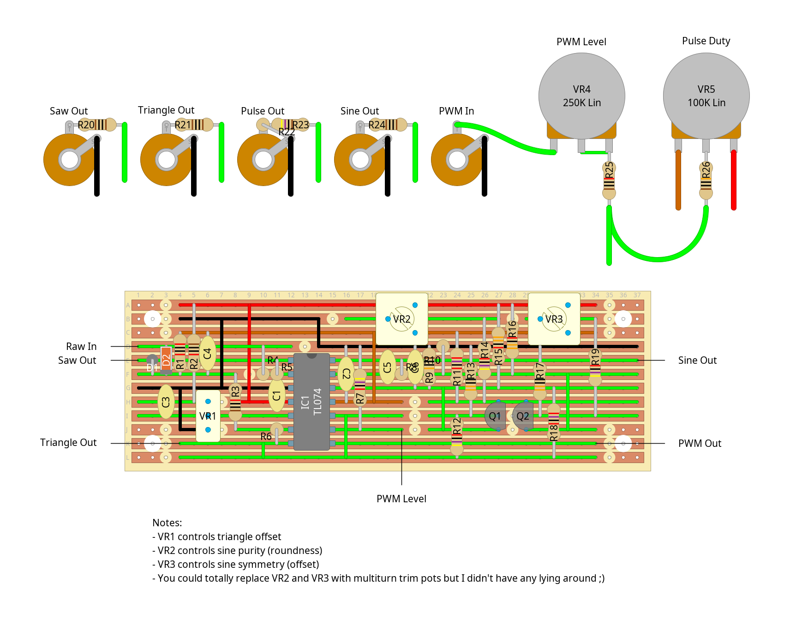

# "dirty doubler" - dual vco module

## description

a dual saw core vco with saw, triangle, pwm and sine(ish) outputs.

the core design is inspired by the [mki x erica synths "edu diy vco"](https://www.ericasynths.lv/media/VCO_FINAL.pdf), and the waveshapers are based on the [mfos 1v/oct vco](http://musicfromouterspace.com/analogsynth_new/VCO20120618REV0/VCO20120618REV0.html) (saw-triangle) and [aries ar-317 vco](https://modularsynthesis.com/aries/AR-317/Aries%20AR-317%20VCO.pdf) (triangle-pwm and triangle-sine). the result is kind of a mess of different circuit design sensibilities and i'm no electrical engineer, so there's probably a few extra components in there that could be dropped. either way, it works and sounds good to me. definitely gonna just use one of those 3340 chips next time i build a vco though cos this thing was a pain to build...

## schematics

### circuit diagram (core)

### stripboard layout (core)

### bill of materials (core)
<table cellspacing="0" border="1">
  <tr>
    <th>Name</th>
    <th>Value</th>
    <th>Quantity</th>
    <th>Notes</th>
  </tr>
  <tr>
    <td>Vero Board</td>
    <td>37 columns x 24 rows</td>
    <td>1</td>
    <td></td>
  </tr>
  <tr>
    <td>C1, C2</td>
    <td>10uF 50V electrolytic capacitors</td>
    <td>2</td>
    <td></td>
  </tr>
  <tr>
    <td>C3, C4, C5, C6, C7</td>
    <td>0.1uF 50V ceramic capacitors</td>
    <td>5</td>
    <td></td>
  </tr>
  <tr>
    <td>C8, C9</td>
    <td>2.2nF 50V ceramic capacitors</td>
    <td>2</td>
    <td></td>
  </tr>
  <tr>
    <td>D1, D2</td>
    <td>1N4007 rectifier diodes</td>
    <td>2</td>
    <td></td>
  </tr>
  <tr>
    <td>D3, D4</td>
    <td>1N4148 signal diodes</td>
    <td>2</td>
    <td></td>
  </tr>
  <tr>
    <td>IC1</td>
    <td>CD40106 hex schmitt-trigger inverter</td>
    <td>1</td>
    <td></td>
  </tr>
  <tr>
    <td>IC2</td>
    <td>TL074 quad op-amp</td>
    <td>1</td>
    <td></td>
  </tr>
  <tr>
    <td>J1, J2, J3, J4</td>
    <td>3.5mm mono jack sockets</td>
    <td>4</td>
    <td></td>
  </tr>
  <tr>
    <td>PH1</td>
    <td>10 pin IDC socket</td>
    <td>1</td>
    <td></td>
  </tr>
  <tr>
    <td>Q1, Q2</td>
    <td>BC557</td>
    <td>2</td>
    <td></td>
  </tr>
  <tr>
    <td>Q3, Q4</td>
    <td>BC547</td>
    <td>2</td>
    <td></td>
  </tr>
  <tr>
    <td>R1, R2</td>
    <td>10Ω 0.25W resistors</td>
    <td>2</td>
    <td></td>
  </tr>
  <tr>
    <td>R3, R9</td>
    <td>1.5K 0.25W resistors</td>
    <td>2</td>
    <td></td>
  </tr>
  <tr>
    <td>R4, R10, R26, R33</td>
    <td>1M 0.25W resistors</td>
    <td>4</td>
    <td></td>
  </tr>
  <tr>
    <td>R5, R7, R11, R13, R25, R32</td>
    <td>33K 0.25W resistors</td>
    <td>6</td>
    <td></td>
  </tr>
  <tr>
    <td>R6, R8, R12, R14</td>
    <td>10K 0.25W resistors</td>
    <td>4</td>
    <td></td>
  </tr>
  <tr>
    <td>R15, R16, R17, R18, R19, R20, R21, R22</td>
    <td>10K NTC thermistors</td>
    <td>8</td>
    <td></td>
  </tr>
  <tr>
    <td>R23, R24, R27, R28, R29, R30, R31, R34, R35, R36</td>
    <td>100K 0.25W resistors</td>
    <td>10</td>
    <td></td>
  </tr>
  <tr>
    <td>VR1, VR2</td>
    <td>1K linear multi-turn trim pots</td>
    <td>2</td>
    <td></td>
  </tr>
  <tr>
    <td>VR3, VR4</td>
    <td>20K linear multi-turn trim pots</td>
    <td>2</td>
    <td></td>
  </tr>
  <tr>
    <td>VR5, VR6, VR7, VR8, VR9, VR10</td>
    <td>100K linear potentiometers</td>
    <td>6</td>
    <td></td>
  </tr>
</table>

### circuit diagram (waveshaper)

(you'll want two of these, one per core)

### stripboard layout (waveshaper)

### bill of materials (waveshaper)

<table cellspacing="0" border="1">
  <tr>
    <th>Name</th>
    <th>Value</th>
    <th>Quantity</th>
    <th>Notes</th>
  </tr>
  <tr>
    <td>Vero Board</td>
    <td>37 columns x 12 rows</td>
    <td>1</td>
    <td></td>
  </tr>
  <tr>
    <td>C1, C2, C3</td>
    <td>0.1uF 50V ceramic capacitors</td>
    <td>3</td>
    <td></td>
  </tr>
  <tr>
    <td>C4</td>
    <td>2.2nF 50V ceramic capacitor</td>
    <td>1</td>
    <td></td>
  </tr>
  <tr>
    <td>C5, C6</td>
    <td>47pF 50V ceramic capacitors</td>
    <td>2</td>
    <td></td>
  </tr>
  <tr>
    <td>D1, D2</td>
    <td>1N4148 signal diodes</td>
    <td>2</td>
    <td></td>
  </tr>
  <tr>
    <td>IC1</td>
    <td>TL074 quad op-amp</td>
    <td>1</td>
    <td></td>
  </tr>
  <tr>
    <td>J1, J2, J3, J4, J5</td>
    <td>3.5mm mono jack sockets</td>
    <td>5</td>
    <td></td>
  </tr>
  <tr>
    <td>Q1, Q2</td>
    <td>BC547</td>
    <td>2</td>
    <td></td>
  </tr>
  <tr>
    <td>R1, R6</td>
    <td>20K 0.25W resistors</td>
    <td>2</td>
    <td></td>
  </tr>
  <tr>
    <td>R2, R3, R4, R5, R25</td>
    <td>10K 0.25W resistors</td>
    <td>5</td>
    <td></td>
  </tr>
  <tr>
    <td>R7, R12, R14, R19</td>
    <td>47K 0.25W resistors</td>
    <td>4</td>
    <td></td>
  </tr>
  <tr>
    <td>R8, R9, R26</td>
    <td>100K 0.25W resistors</td>
    <td>3</td>
    <td></td>
  </tr>
  <tr>
    <td>R10, R11, R18</td>
    <td>27K 0.25W resistors</td>
    <td>3</td>
    <td></td>
  </tr>
  <tr>
    <td>R13, R17</td>
    <td>330Ω 0.25W resistors</td>
    <td>2</td>
    <td></td>
  </tr>
  <tr>
    <td>R15, R16</td>
    <td>33K 0.25W resistors</td>
    <td>2</td>
    <td></td>
  </tr>
  <tr>
    <td>R20, R21, R24</td>
    <td>1K 0.25W resistors</td>
    <td>3</td>
    <td></td>
  </tr>
  <tr>
    <td>R22</td>
    <td>3.3K 0.25W resistor</td>
    <td>1</td>
    <td></td>
  </tr>
  <tr>
    <td>R23</td>
    <td>4.7K 0.25W resistor</td>
    <td>1</td>
    <td></td>
  </tr>
  <tr>
    <td>VR1</td>
    <td>10K linear multi-turn trim pot</td>
    <td>1</td>
    <td></td>
  </tr>
  <tr>
    <td>VR2, VR3</td>
    <td>47K linear trim pots</td>
    <td>2</td>
    <td></td>
  </tr>
  <tr>
    <td>VR4</td>
    <td>250K linear potentiometer</td>
    <td>1</td>
    <td></td>
  </tr>
  <tr>
    <td>VR5</td>
    <td>100K linear potentiometer</td>
    <td>1</td>
    <td></td>
  </tr>
</table>
