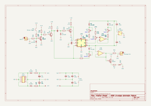
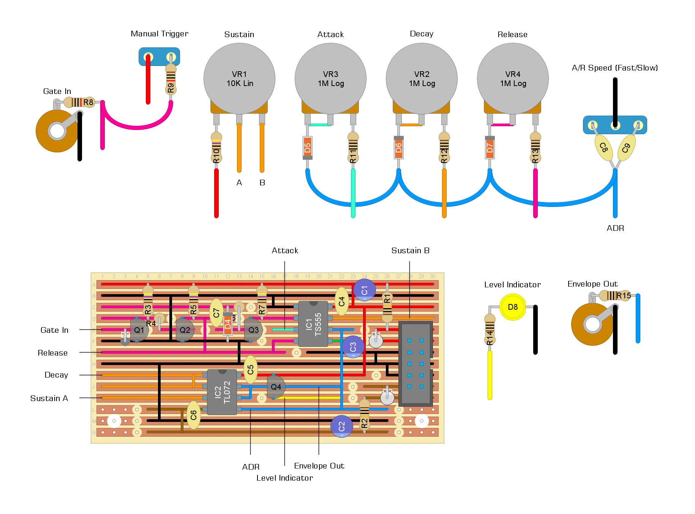

# "another shape" - adsr envelope generator module

## description

adsr envelope generator mostly based on
[rené schmitz' "fastest envelope in the west"](https://www.schmitzbits.de/adsr.html), but with a few extra features inspired by other envelope generators:
- fast/slow switch and manual trigger inspired by [yves usson's yusynth adsr](http://yusynth.net/Modular/EN/ADSR/index_latest.html)
- indicator led inspired by [mki x erica synths' "edu diy eg"](https://www.ericasynths.lv/shop/diy-kits-1/edu-diy-eg/)

i considered trying to add a loop function based on the one shown [here](https://github.com/m0xpd/ADSR) but decided against it since i'd already added a bunch of extra stuff already. it's designed as an extension of the yusynth design but i think it could probably be adapted to work with a feitw-based design? maybe i'll try it some day...

## schematics

### circuit diagram

### stripboard layout

### bill of materials
<table cellspacing="0" border="1">
  <tr>
    <th>Name</th>
    <th>Value</th>
    <th>Quantity</th>
    <th>Notes</th>
  </tr>
  <tr>
    <td>Vero Board</td>
    <td>30 columns x 16 rows (strips)</td>
    <td>1</td>
    <td></td>
  </tr>
  <tr>
    <td>C1, C2, C3</td>
    <td>10uF 50V electrolytic capacitors</td>
    <td>3</td>
    <td>C3 can be ceramic</td>
  </tr>
  <tr>
    <td>C4, C5, C6</td>
    <td>100nF 50V ceramic capacitors</td>
    <td>3</td>
    <td></td>
  </tr>
  <tr>
    <td>C7</td>
    <td>10nF 50V ceramic capacitor</td>
    <td>1</td>
    <td></td>
  </tr>
  <tr>
    <td>C8</td>
    <td>470nF 50V ceramic capacitor</td>
    <td>1</td>
    <td></td>
  </tr>
  <tr>
    <td>C9</td>
    <td>4.7uF 50V ceramic capacitor</td>
    <td>1</td>
    <td></td>
  </tr>
  <tr>
    <td>D1, D2</td>
    <td>1N4007 rectifier diodes</td>
    <td>2</td>
    <td></td>
  </tr>
  <tr>
    <td>D3, D4, D5, D6, D7</td>
    <td>1N4148 signal diodes</td>
    <td>5</td>
    <td></td>
  </tr>
  <tr>
    <td>D8</td>
    <td>LED</td>
    <td>1</td>
    <td>i used yellow :)</td>
  </tr>
  <tr>
    <td>IC1</td>
    <td>TS555 cmos timer</td>
    <td>1</td>
    <td>any cmos 555 works</td>
  </tr>
  <tr>
    <td>IC2</td>
    <td>TL072 dual op-amp</td>
    <td>1</td>
    <td></td>
  </tr>
  <tr>
    <td>J1, J2</td>
    <td>3.5mm mono jack sockets</td>
    <td>2</td>
    <td></td>
  </tr>
  <tr>
    <td>PH1</td>
    <td>10 pin IDC socket</td>
    <td>1</td>
    <td></td>
  </tr>
  <tr>
    <td>Q1, Q2, Q3, Q4</td>
    <td>BC547</td>
    <td>4</td>
    <td>BC548 probably works too</td>
  </tr>
  <tr>
    <td>R1, R2</td>
    <td>10Ω 0.25W resistors</td>
    <td>2</td>
    <td></td>
  </tr>
  <tr>
    <td>R3, R5, R7, R10</td>
    <td>4.7K 0.25W resistors</td>
    <td>4</td>
    <td></td>
  </tr>
  <tr>
    <td>R4</td>
    <td>22K 0.25W resistor</td>
    <td>1</td>
    <td></td>
  </tr>
  <tr>
    <td>R6, R8, R9</td>
    <td>10K 0.25W resistors</td>
    <td>3</td>
    <td></td>
  </tr>
  <tr>
    <td>R11, R12, R13</td>
    <td>100Ω 0.25W resistors</td>
    <td>3</td>
    <td></td>
  </tr>
  <tr>
    <td>R14, R15</td>
    <td>1K 0.25W resistors</td>
    <td>2</td>
    <td>tweak R14 for LED brightness</td>
  </tr>
  <tr>
    <td>SW1</td>
    <td>push-to-make momentary switch</td>
    <td>1</td>
    <td></td>
  </tr>
  <tr>
    <td>SW2</td>
    <td>spdt (on/on) toggle switch</td>
    <td>1</td>
    <td></td>
  </tr>
  <tr>
    <td>VR1</td>
    <td>10K linear potentiometer</td>
    <td>1</td>
    <td></td>
  </tr>
  <tr>
    <td>VR2, VR3, VR4</td>
    <td>1M logarithmic potentiometer</td>
    <td>3</td>
    <td>good luck finding these...</td>
  </tr>
</table>
