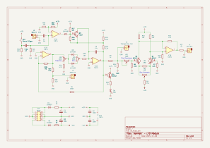
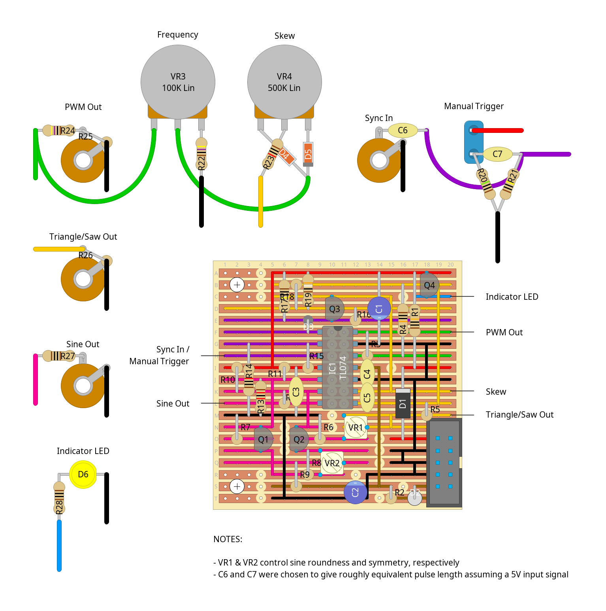

# "wormdo" - lfo module

an lfo with square/pulse, triangle/saw and sine outputs, skew control, and sync input

originally i'd been looking at building something based on the [mfos variable skew lfo](https://musicfromouterspace.com/analogsynth_new/OLDIESBUTGOODIES/LFO/lfo-1.html), but i couldn't figure out how to add a sync input to it (and wasn't really looking to blow one of my xd13700s on triangle-sine conversion). so instead i took the core of the [cgs utility lfo](https://sdiy.info/wiki/CGS_utility_LFO) and replaced the additional square and mix outputs with a sine output (using an adaptation of [eddy bergman's adaptation of thomas henry's triangle-sine converter](https://www.eddybergman.com/2019/11/synthersizer-build-part-3-triangle-to.html)) and a sync input based on a [design from magic smoke electronics](https://electro-music.com/forum/phpbb-files/lfo_sync_r01_magic_smoke_electronics_142.jpg)

it's not exactly the same, but close enough for audio work...?

other notes:

- vr1 and vr2 control sine roundness and symmetry, respectively
- c6 and c7 were chosen to give roughly the same pulse length, assuming a +5v input signal
- the manual trigger is a little janky but my oscilloscope doesn't have the resolution i'd need to debug it.... r20 could probably be lower, or you could just use an on-(on) spdt switch instead and tie the other side to ground

## schematics

### circuit diagram

### stripboard layout

### bill of materials
<table cellspacing="0" border="1">
  <tr>
    <th>Name</th>
    <th>Value</th>
    <th>Quantity</th>
    <th>Notes</th>
  </tr>
  <tr>
    <td>Vero Board</td>
    <td>20 columns x 20 rows</td>
    <td>1</td>
    <td></td>
  </tr>
  <tr>
    <td>C1, C2</td>
    <td>10uF 50V electrolytic capacitors</td>
    <td>2</td>
    <td></td>
  </tr>
  <tr>
    <td>C3, C4</td>
    <td>100nF 50V ceramic capacitors</td>
    <td>2</td>
    <td></td>
  </tr>
  <tr>
    <td>C5</td>
    <td>47nF 50V ceramic capacitor</td>
    <td>1</td>
    <td></td>
  </tr>
  <tr>
    <td>C6</td>
    <td>1nF 50V ceramic capacitor</td>
    <td>1</td>
    <td></td>
  </tr>
  <tr>
    <td>C7</td>
    <td>470pF 50V ceramic capacitor</td>
    <td>1</td>
    <td></td>
  </tr>
  <tr>
    <td>D1, D2</td>
    <td>1N4007 rectifier diodes</td>
    <td>2</td>
    <td></td>
  </tr>
  <tr>
    <td>D3, D4, D5</td>
    <td>1N4148 signal diodes</td>
    <td>3</td>
    <td></td>
  </tr>
  <tr>
    <td>D6</td>
    <td>LED</td>
    <td>1</td>
    <td>i used yellow :)</td>
  </tr>
  <tr>
    <td>IC1</td>
    <td>TL074 quad op-amp</td>
    <td>1</td>
    <td></td>
  </tr>
  <tr>
    <td>J1, J2, J3, J4</td>
    <td>3.5mm mono jack sockets</td>
    <td>4</td>
    <td></td>
  </tr>
  <tr>
    <td>PH1</td>
    <td>10 pin IDC socket</td>
    <td>1</td>
    <td></td>
  </tr>
  <tr>
    <td>Q1, Q2, Q4</td>
    <td>BC547 general purpose transistors</td>
    <td>3</td>
    <td></td>
  </tr>
  <tr>
    <td>Q3</td>
    <td>J113 n-channel JFET</td>
    <td>1</td>
    <td></td>
  </tr>
  <tr>
    <td>R1, R2</td>
    <td>10Ω 0.25W resistors</td>
    <td>2</td>
    <td></td>
  </tr>
  <tr>
    <td>R3</td>
    <td>120K 0.25W resistor</td>
    <td>1</td>
    <td></td>
  </tr>
  <tr>
    <td>R4, R15</td>
    <td>100K 0.25W resistors</td>
    <td>2</td>
    <td></td>
  </tr>
  <tr>
    <td>R5, R26, R27, R28</td>
    <td>1K 0.25W resistors</td>
    <td>4</td>
    <td></td>
  </tr>
  <tr>
    <td>R6, R7</td>
    <td>2.2K 0.25W resistors</td>
    <td>2</td>
    <td></td>
  </tr>
  <tr>
    <td>R8</td>
    <td>390Ω 0.25W resistor</td>
    <td>1</td>
    <td></td>
  </tr>
  <tr>
    <td>R9</td>
    <td>15K 0.25W resistor</td>
    <td>1</td>
    <td></td>
  </tr>
  <tr>
    <td>R10, R11, R14, R23</td>
    <td>10K 0.25W resistors</td>
    <td>4</td>
    <td></td>
  </tr>
  <tr>
    <td>R12, R13</td>
    <td>12K 0.25W resistors</td>
    <td>2</td>
    <td></td>
  </tr>
  <tr>
    <td>R16, R20</td>
    <td>10M 0.25W resistors</td>
    <td>2</td>
    <td></td>
  </tr>
  <tr>
    <td>R17, R21</td>
    <td>1M 0.25W resistors</td>
    <td>2</td>
    <td></td>
  </tr>
  <tr>
    <td>R18, R25</td>
    <td>3.3K 0.25W resistors</td>
    <td>2</td>
    <td></td>
  </tr>
  <tr>
    <td>R19</td>
    <td>3.9K 0.25W resistor</td>
    <td>1</td>
    <td></td>
  </tr>
  <tr>
    <td>R22, R24</td>
    <td>4.7K 0.25W resistors</td>
    <td>2</td>
    <td></td>
  </tr>
  <tr>
    <td>SW1</td>
    <td>push-to-make momentary switch</td>
    <td>1</td>
    <td></td>
  </tr>
  <tr>
    <td>VR1</td>
    <td>100K linear trim pot</td>
    <td>1</td>
    <td></td>
  </tr>
  <tr>
    <td>VR2</td>
    <td>47K linear trim pot</td>
    <td>1</td>
    <td></td>
  </tr>
  <tr>
    <td>VR3</td>
    <td>100K linear potentiometer</td>
    <td>1</td>
    <td></td>
  </tr>
  <tr>
    <td>VR4</td>
    <td>500K linear potentiometer</td>
    <td>1</td>
    <td></td>
  </tr>
</table>
