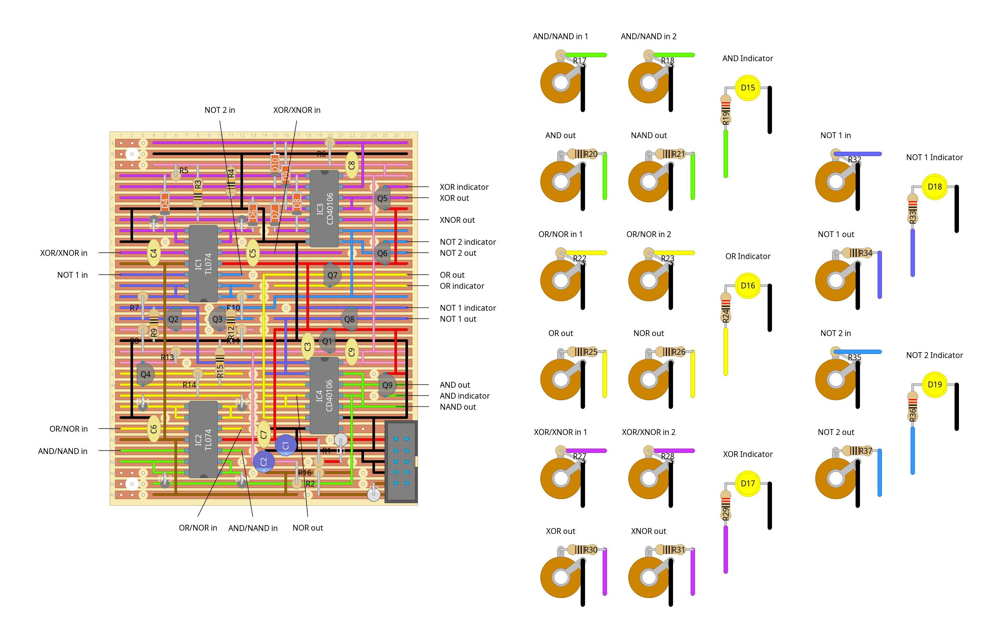

# "double negative" - logic module

logic module using circuits based on those described in [ray wilson's article on mml logic](https://musicfromouterspace.com/analogsynth_new/ELECTRONICS/mickeymouselogic.html) to create the following gates:

- and
- nand
- or
- nor
- xor
- xnor
- not (x2)

originally i just wanted to make a module with a couple not gates so i could use my baby8 sequencer properly (since its clock input is active low for some reason and i didn't feel like reprogramming the clock module to have all its outputs backwards), but the 40106 has 6 inverters and it felt like a shame to waste the rest. apparently things spiralled out of control at some point along the way though because now the module uses 2 of them thanks to the xor/xnor gates being constructed out of 4 nand circuits. and it still wastes an inverter! but the xor has stolen the show since building this so i'm not too torn up over it. its worth it for a cool rhythm.

my main tweak to the original circuit designs is that i wanted the gates to support taking audio signals as inputs (which aren't necessarily capped at +5v) as well as the output from my clock module (which is definitely capped at +5v), and to output at +5v either way, so i'm using 5v for the pull up resistors instead of 12v and i've thrown in some transistors to cap the voltage at 5v before any pull down resistors. this means that for each gate circuit the signal gets limited to 5v before it gets to the inputs of the 40106, which is also running off 5v, and so outputs at 5v. 5v 5v 5v.

(i thought i could get away with just feeding whatever voltage into the 40106 and that as long as it was running off 5v it'd just cap it there, but nope turns out the higher voltage wins and it puts out 12v. even when powered off! its scary!!)

other notes:

- i've noticed sometimes the xor gate flickers on for a split second when the inputs both switch state at the same time (eg. from both on to both off or vice versa). i'm not sure if this is an issue with this module or with my clock module though...
- as with the clock module the 220Ω resistors on the leds are to match the brightness against other leds in my synth, so you might want to play with those if you're not using ultra-bright yellow leds!

## schematics

### logic module

### bill of materials
<table cellspacing="0" border="1">
  <tr>
    <th>Name</th>
    <th>Value</th>
    <th>Quantity</th>
    <th>Notes</th>
  </tr>
  <tr>
    <td>Vero Board</td>
    <td>27 columns x 33 rows</td>
    <td>1</td>
    <td></td>
  </tr>
  <tr>
    <td>C1, C2</td>
    <td>10uF 50V electrolytic capacitors</td>
    <td>2</td>
    <td></td>
  </tr>
  <tr>
    <td>C3, C4, C5, C6, C7, C8, C9</td>
    <td>0.1uF 50V ceramic capacitors</td>
    <td>7</td>
    <td></td>
  </tr>
  <tr>
    <td>D1, D2</td>
    <td>1N4007 rectifier diodes</td>
    <td>2</td>
    <td></td>
  </tr>
  <tr>
    <td>D3, D4, D5, D6, D7, D8, D9, D10, D11, D12, D13, D14</td>
    <td>1N4148 signal diodes</td>
    <td>12</td>
    <td></td>
  </tr>
  <tr>
    <td>D15, D16, D17, D18, D19</td>
    <td>LED</td>
    <td>5</td>
    <td>i used yellow :)</td>
  </tr>
  <tr>
    <td>IC1, IC2</td>
    <td>TL074 quad op-amp</td>
    <td>2</td>
    <td></td>
  </tr>
  <tr>
    <td>IC3, IC4</td>
    <td>CD40106 hex schmitt-trigger inverter</td>
    <td>2</td>
    <td></td>
  </tr>
  <tr>
    <td>J1, J2, J3, J4, J5, J6, J7, J8, J9, J10, J11, J12, J13, J14, J15, J16</td>
    <td>3.5mm mono jack sockets</td>
    <td>16</td>
    <td></td>
  </tr>
  <tr>
    <td>PH1</td>
    <td>10 pin IDC socket</td>
    <td>1</td>
    <td></td>
  </tr>
  <tr>
    <td>Q1</td>
    <td>78L05 5V linear regulator</td>
    <td>1</td>
    <td></td>
  </tr>
  <tr>
    <td>Q2, Q3, Q4, Q5, Q6, Q7, Q8, Q9</td>
    <td>BC547 general purpose transistors</td>
    <td>8</td>
    <td>BC548 probably works too</td>
  </tr>
  <tr>
    <td>R1, R2</td>
    <td>10Ω 0.25W resistors</td>
    <td>2</td>
    <td></td>
  </tr>
  <tr>
    <td>R3, R4, R5, R6, R7, R9, R10, R12, R14, R15, R16, R17, R18, R22, R23, R27, R28, R32, R35</td>
    <td>100K 0.25W resistors</td>
    <td>19</td>
    <td></td>
  </tr>
  <tr>
    <td>R8, R11, R13, R20, R21, R25, R26, R30, R31, R34, R37</td>
    <td>1K 0.25W resistors</td>
    <td>11</td>
    <td></td>
  </tr>
  <tr>
    <td>R19, R24, R29, R33, R36</td>
    <td>220Ω 0.25W resistors</td>
    <td>5</td>
    <td></td>
  </tr>
</table>
