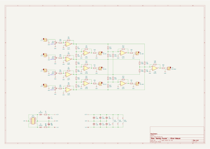
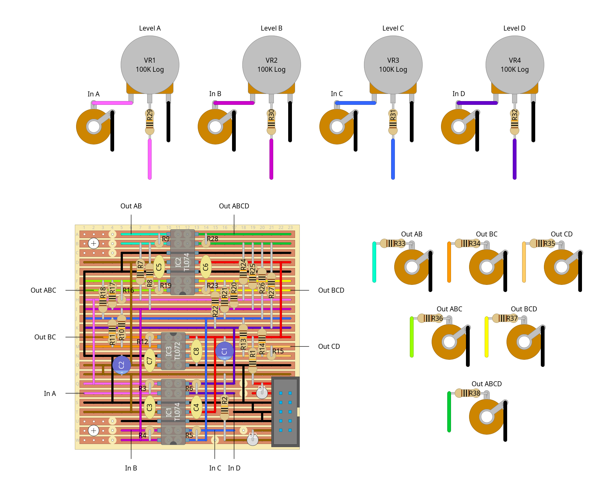

# "monkey puzzle" - 4-in/6-out mixer module

a 4-input active mixer with 6 outputs, each giving a different combination of channels. given inputs A, B, C and D, the outputs are:

- AB
- BC
- CD
- ABC
- BCD
- ABCD

i didn't really wanna just make a standard 4 to 1 mixer, but i'm getting low on space in the rack so i wasn't super into the idea of making a matrix mixer either (they're **wide**). instead i kinda split the difference and made, whatever this is... i guess you could call it a tree mixer?

i couldn't find any other examples of a mixer with outputs like this so the design is all me for once, although i did reference the mixer examples on [doepfer's diy page](https://www.doepfer.de/DIY/a100_diy.htm) to see how they usually work. that said, i'm sure im not the first to design a mixer module with outputs like this, especially since it also lets the mixer act as 2 separate 2-in, 1-out mixers, or as a 1x 1-5/2x 1-2 active multiple. i think it should accept dc input too since there's no caps along the signal path, but i've not tried it yet...

## schematics

### circuit diagram

### stripboard layout

### bill of materials
<table cellspacing="0" border="1">
  <tr>
    <th>Name</th>
    <th>Value</th>
    <th>Quantity</th>
    <th>Notes</th>
  </tr>
  <tr>
    <td>Vero Board</td>
    <td>23 columns x 23 rows</td>
    <td>1</td>
    <td></td>
  </tr>
  <tr>
    <td>C1, C2</td>
    <td>10uF 50V electrolytic capacitors</td>
    <td>2</td>
    <td></td>
  </tr>
  <tr>
    <td>C3, C4, C5, C6, C7, C8</td>
    <td>100nF 50V ceramic capacitors</td>
    <td>6</td>
    <td></td>
  </tr>
  <tr>
    <td>D1, D2</td>
    <td>1N4007 rectifier diodes</td>
    <td>2</td>
    <td></td>
  </tr>
  <tr>
    <td>IC1, IC2</td>
    <td>TL074 quad op-amps</td>
    <td>2</td>
    <td></td>
  </tr>
  <tr>
    <td>IC3</td>
    <td>TL072 dual op-amp</td>
    <td>1</td>
    <td></td>
  </tr>
  <tr>
    <td>J1, J2, J3, J4, J5, J6, J7, J8, J9, J10</td>
    <td>3.5mm mono jack sockets</td>
    <td>10</td>
    <td></td>
  </tr>
  <tr>
    <td>PH1</td>
    <td>10 pin IDC socket</td>
    <td>1</td>
    <td></td>
  </tr>
  <tr>
    <td>R1, R2</td>
    <td>10Ω 0.25W resistors</td>
    <td>2</td>
    <td></td>
  </tr>
  <tr>
    <td>R3, R4, R5, R6, R7, R8, R9, R10, R11, R12, R13, R14, R15, R16, R17, R18, R19, R20, R21, R22, R23, R24, R25, R26, R27, R28, R29, R30, R31, R32</td>
    <td>100K 0.25W resistors</td>
    <td>30</td>
    <td></td>
  </tr>
  <tr>
    <td>R33, R34, R35, R36, R37, R38</td>
    <td>1K 0.25W resistors</td>
    <td>6</td>
    <td></td>
  </tr>
  <tr>
    <td>VR1, VR2, VR3, VR4</td>
    <td>100K logarithmic potentiometers</td>
    <td>4</td>
    <td></td>
  </tr>
</table>
