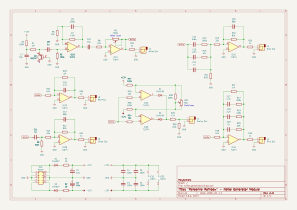
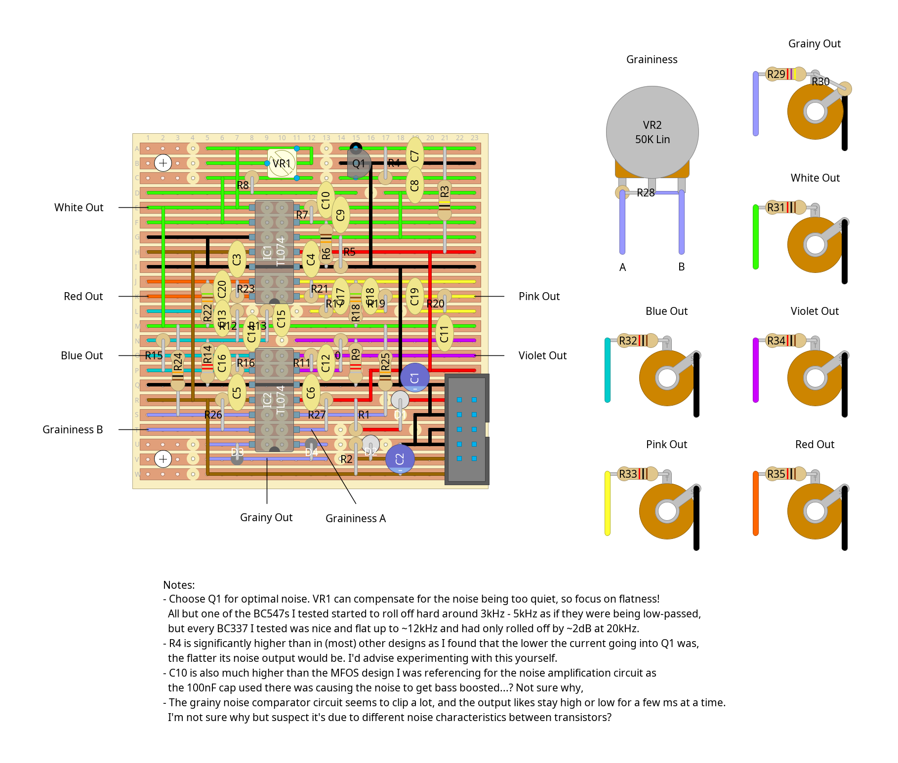

# "mersenne rainbow" - noise generator module

a noise generator module with 5 colours of noise, as well as adjustable grainy noise

this one gave me a lot of trouble... at first i was just gonna make something simple based on [moritz klein's 3-colour noise generator](https://www.youtube.com/watch?v=0yB_h_wFkh4), but when i realised how much free space there'd be on the panel with only 3 outputs i got to wondering how to add violet and red/brownian noise, and then i fell down the filter design hole trying to make the pink and blue noise more accurate. every time i thought i'd figured it out something would turn out not quite right and in the end i just kinda wanted to be done with it and move on,

as such, i highly recommend experimenting with this yourself before building it. the pink and red/brownian noise filters are based on [justin silver's design](https://github.com/j-silv/colored-noise-generator) (in turn based on [this article by rod elliott](https://sound-au.com/project11.htm)), and are pretty accurate despite my tweaking the values to avoid buying component values i didn't already have. the blue and violet filters, on the other hand, are the result of me tweaking the values of the aformentioned 3-colour noise generator for several days, and although they seemed accurate enough on the breadboard i realised after i'd built the module that i'd been testing the signals before amplification, and the op amps were adding a lot of low frequency noise that skewed the frequency distributions horribly. adding a few extra caps sort of fixed it (i've included these in the schematics) but the result is still not particularly accurate. i've since tested a version using active high pass filters that include the amplification rather than the passive high pass filters with separate amplification seen below, and it seems to give a much cleaner result. i don't really feel like spending several more weeks redesigning and rebuilding the entire stripboard circuit when what i have is "good enough" though, so keep an eye out for those when i eventually make v2 of this ;)

oh, and the grainy noise generator is based on the [mfos noise cornucopia](https://musicfromouterspace.com/analogsynth_new/NOISECORNREV01/NOISECORNREV01.php) (which i also referenced for amplifying the white noise signal to a usable level). mostly i just added it so i'd have a pot to mount the circuit bracket on, but i think it'll be useful for generating random triggers at some point. that'll probably require another module though...

## schematics

### circuit diagram

### stripboard layout

### bill of materials
<table cellspacing="0" border="1">
  <tr>
    <th>Name</th>
    <th>Value</th>
    <th>Quantity</th>
    <th>Notes</th>
  </tr>
  <tr>
    <td>Vero Board</td>
    <td>23 columns x 23 rows</td>
    <td>1</td>
    <td></td>
  </tr>
  <tr>
    <td>C1, C2</td>
    <td>10uF 50V electrolytic capacitors</td>
    <td>2</td>
    <td></td>
  </tr>
  <tr>
    <td>C3, C4, C5, C6</td>
    <td>100nF 50V ceramic capacitors</td>
    <td>4</td>
    <td></td>
  </tr>
  <tr>
    <td>C7, C10</td>
    <td>10uF 50V ceramic capacitors</td>
    <td>2</td>
    <td></td>
  </tr>
  <tr>
    <td>C8</td>
    <td>1uF 50V ceramic capacitor</td>
    <td>1</td>
    <td></td>
  </tr>
  <tr>
    <td>C9</td>
    <td>100pF 50V ceramic capacitor</td>
    <td>1</td>
    <td></td>
  </tr>
  <tr>
    <td>C11, C14, C19</td>
    <td>1nF 50V ceramic capacitors</td>
    <td>3</td>
    <td></td>
  </tr>
  <tr>
    <td>C12, C16</td>
    <td>68pF 50V ceramic capacitors</td>
    <td>2</td>
    <td></td>
  </tr>
  <tr>
    <td>C13</td>
    <td>6.8nF 50V ceramic capacitor</td>
    <td>1</td>
    <td></td>
  </tr>
  <tr>
    <td>C15, C18</td>
    <td>2.2nF 50V ceramic capacitors</td>
    <td>2</td>
    <td></td>
  </tr>
  <tr>
    <td>C17, C20</td>
    <td>4.7nF 50V ceramic capacitors</td>
    <td>2</td>
    <td></td>
  </tr>
  <tr>
    <td>D1, D2</td>
    <td>1N4007 rectifier diodes</td>
    <td>2</td>
    <td></td>
  </tr>
  <tr>
    <td>D3, D4</td>
    <td>1N4148 signal diodes</td>
    <td>2</td>
    <td></td>
  </tr>
  <tr>
    <td>IC1, IC2</td>
    <td>TL074 quad op-amps</td>
    <td>2</td>
    <td></td>
  </tr>
  <tr>
    <td>IC3</td>
    <td>TL072 dual op-amp</td>
    <td>1</td>
    <td></td>
  </tr>
  <tr>
    <td>J1, J2, J3, J4, J5, J6</td>
    <td>3.5mm mono jack sockets</td>
    <td>6</td>
    <td></td>
  </tr>
  <tr>
    <td>PH1</td>
    <td>10 pin IDC socket</td>
    <td>1</td>
    <td></td>
  </tr>
  <tr>
    <td>Q1</td>
    <td>BC337 general purpose transistor</td>
    <td>1</td>
    <td></td>
  </tr>
  <tr>
    <td>R1, R2</td>
    <td>10Ω 0.25W resistors</td>
    <td>2</td>
    <td></td>
  </tr>
  <tr>
    <td>R3, R5, R19, R26, R27</td>
    <td>100K 0.25W resistors</td>
    <td>5</td>
    <td></td>
  </tr>
  <tr>
    <td>R4, R21, R23</td>
    <td>1M 0.25W resistors</td>
    <td>3</td>
    <td></td>
  </tr>
  <tr>
    <td>R6, R8, R24, R25</td>
    <td>10K 0.25W resistors</td>
    <td>4</td>
    <td></td>
  </tr>
  <tr>
    <td>R7</td>
    <td>470K 0.25W resistor</td>
    <td>1</td>
    <td></td>
  </tr>
  <tr>
    <td>R9, R14</td>
    <td>8.2K 0.25W resistors</td>
    <td>2</td>
    <td></td>
  </tr>
  <tr>
    <td>R10, R15</td>
    <td>33K 0.25W resistors</td>
    <td>2</td>
    <td></td>
  </tr>
  <tr>
    <td>R11, R16</td>
    <td>82K 0.25W resistors</td>
    <td>2</td>
    <td></td>
  </tr>
  <tr>
    <td>R12, R17, R28</td>
    <td>200K 0.25W resistors</td>
    <td>3</td>
    <td></td>
  </tr>
  <tr>
    <td>R13, R18, R22</td>
    <td>51K 0.25W resistors</td>
    <td>3</td>
    <td></td>
  </tr>
  <tr>
    <td>R20</td>
    <td>20K 0.25W resistor</td>
    <td>1</td>
    <td></td>
  </tr>
  <tr>
    <td>R29</td>
    <td>4.7K 0.25W resistor</td>
    <td>1</td>
    <td></td>
  </tr>
  <tr>
    <td>R30</td>
    <td>3.3K 0.25W resistor</td>
    <td>1</td>
    <td></td>
  </tr>
  <tr>
    <td>R31, R32, R33, R34, R35</td>
    <td>1K 0.25W resistors</td>
    <td>5</td>
    <td></td>
  </tr>
  <tr>
    <td>VR1</td>
    <td>500K linear trim pot</td>
    <td>1</td>
    <td></td>
  </tr>
  <tr>
    <td>VR2</td>
    <td>47K linear potentiometer</td>
    <td>1</td>
    <td></td>
  </tr>
</table>
