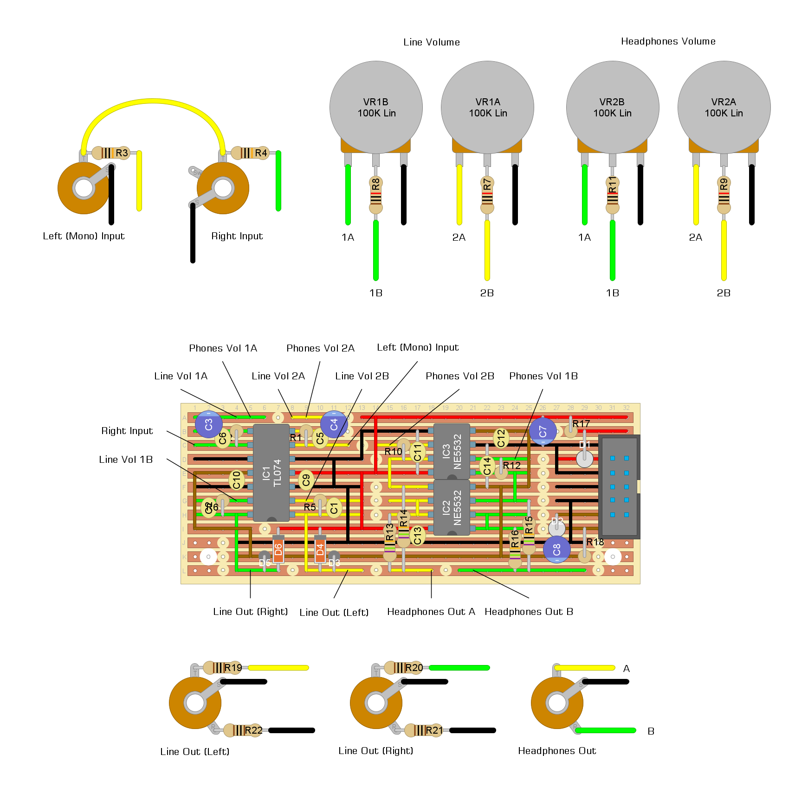

# "green brick" - output module

## description

4hp output module based on the schematic for [befaco's "out v3" module](https://www.befaco.org/out-v3/).

i simplified the design a bit:
- dropped the cue input/switch and signal monitoring leds
- swapped the two tl072s for a single tl074
- replaced the ferrite beads on the power input circuit with 10Ω resistors
- used 3.5mm jack sockets for line out (this might have been a bad idea, not sure yet...)

## schematics

### output module

## license

[![CC BY-NC-SA 4.0][cc-by-nc-sa-shield]][cc-by-nc-sa]

this work is licensed under a
[creative commons attribution-noncommercial-sharealike 4.0 international license][cc-by-nc-sa]

[![CC BY-NC-SA 4.0][cc-by-nc-sa-image]][cc-by-nc-sa]

[cc-by-nc-sa]: http://creativecommons.org/licenses/by-nc-sa/4.0/
[cc-by-nc-sa-image]: https://licensebuttons.net/l/by-nc-sa/4.0/88x31.png
[cc-by-nc-sa-shield]: https://img.shields.io/badge/License-CC%20BY--NC--SA%204.0-lightgrey.svg
