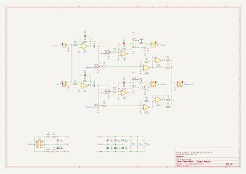

# "green brick" - output module

## description

4hp output module based on the schematic for [befaco's "out v3" module](https://www.befaco.org/out-v3/).

i simplified the design a bit:
- dropped the cue input/switch and signal monitoring leds
- swapped the two tl072s for a single tl074
- replaced the ferrite beads on the power input circuit with 10Ω resistors
- used 3.5mm jack sockets for line out (this might have been a bad idea, not sure yet...)

## schematics

### circuit diagram

### stripboard layout

### bill of materials

<table cellspacing="0" border="1">
  <tr>
    <th>Name</th>
    <th>Value</th>
    <th>Quantity</th>
    <th>Notes</th>
  </tr>
  <tr>
    <td>Vero Board</td>
    <td>32 columns x 12 rows</td>
    <td>1</td>
    <td></td>
  </tr>
  <tr>
    <td>C1, C2, C9, C10</td>
    <td>10uF 50V electrolytic capacitors</td>
    <td>4</td>
    <td></td>
  </tr>
  <tr>
    <td>C3, C4, C5, C6, C7, C8</td>
    <td>100nF 50V ceramic capacitors</td>
    <td>6</td>
    <td></td>
  </tr>
  <tr>
    <td>C11, C12, C13, C14</td>
    <td>10pF 50V ceramic capacitors</td>
    <td>4</td>
    <td></td>
  </tr>
  <tr>
    <td>D1, D2</td>
    <td>1N4007 rectifier diodes</td>
    <td>2</td>
    <td></td>
  </tr>
  <tr>
    <td>D3, D4, D5, D6</td>
    <td>1N4148 signal diodes</td>
    <td>4</td>
    <td></td>
  </tr>
  <tr>
    <td>IC1</td>
    <td>TL074 quad op-amp</td>
    <td>1</td>
    <td></td>
  </tr>
  <tr>
    <td>IC2, IC3</td>
    <td>NE5532 dual op-amps</td>
    <td>2</td>
    <td></td>
  </tr>
  <tr>
    <td>J1</td>
    <td>3.5mm mono jack socket</td>
    <td>1</td>
    <td></td>
  </tr>
  <tr>
    <td>J2</td>
    <td>3.5mm mono jack socket (switched)</td>
    <td>1</td>
    <td></td>
  </tr>
  <tr>
    <td>J3, J4, J5</td>
    <td>3.5mm stereo jack sockets</td>
    <td>3</td>
    <td></td>
  </tr>
  <tr>
    <td>PH1</td>
    <td>10 pin IDC socket</td>
    <td>1</td>
    <td></td>
  </tr>
  <tr>
    <td>R1, R2</td>
    <td>10Ω 0.25W resistors</td>
    <td>2</td>
    <td></td>
  </tr>
  <tr>
    <td>R3, R6, R8, R10, R15, R16, R17, R18</td>
    <td>10K 0.25W resistors</td>
    <td>8</td>
    <td></td>
  </tr>
  <tr>
    <td>R4, R5</td>
    <td>39K 0.25W resistors</td>
    <td>2</td>
    <td></td>
  </tr>
  <tr>
    <td>R7, R9, R11, R12</td>
    <td>75Ω 0.25W resistors</td>
    <td>4</td>
    <td></td>
  </tr>
  <tr>
    <td>R13, R14</td>
    <td>100K 0.25W resistors</td>
    <td>2</td>
    <td></td>
  </tr>
  <tr>
    <td>R19, R20, R21, R22</td>
    <td>1K 0.25W resistors</td>
    <td>4</td>
    <td></td>
  </tr>
  <tr>
    <td>VR1, VR2</td>
    <td>100K linear potentiometers (stereo)</td>
    <td>2</td>
    <td>shown as VR1A/B, VR2A/B</td>
  </tr>
</table>

## license

[![CC BY-NC-SA 4.0][cc-by-nc-sa-shield]][cc-by-nc-sa]

this work is licensed under a
[creative commons attribution-noncommercial-sharealike 4.0 international license][cc-by-nc-sa]

[![CC BY-NC-SA 4.0][cc-by-nc-sa-image]][cc-by-nc-sa]

[cc-by-nc-sa]: http://creativecommons.org/licenses/by-nc-sa/4.0/
[cc-by-nc-sa-image]: https://licensebuttons.net/l/by-nc-sa/4.0/88x31.png
[cc-by-nc-sa-shield]: https://img.shields.io/badge/License-CC%20BY--NC--SA%204.0-lightgrey.svg
