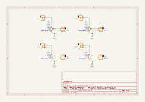
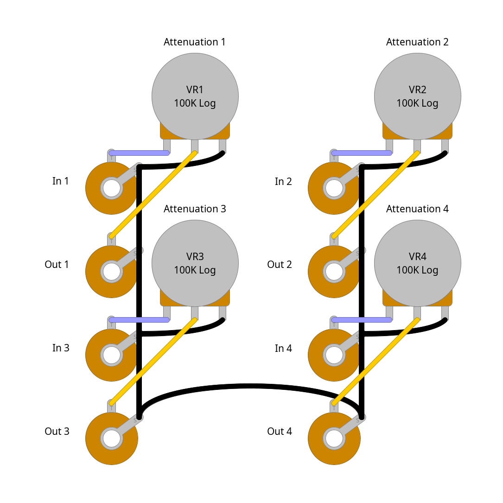

# "macro/micro" - 4x passive attenuator module

## description

4x passive attenuator. inspired by the
[fonotronik 5x passive attenuator](http://www.modular.fonik.de/Page13.html),
except i couldn't fit a 5th pot in there without compromising on spacing.
fully panel wired. banged it out in a weekend.

not much else to say on this one!

## schematics

### circuit diagram

### stripboard layout

### bill of materials
<table cellspacing="0" border="1">
  <tr>
    <th>Name</th>
    <th>Value</th>
    <th>Quantity</th>
    <th>Notes</th>
  </tr>
  <tr>
    <td>J1, J2, J3, J4, J5, J6, J7, J8</td>
    <td>3.5mm mono jack sockets</td>
    <td>8</td>
    <td></td>
  </tr>
  <tr>
    <td>VR1, VR2, VR3, VR4</td>
    <td>100k logarithmic potentiometers</td>
    <td>4</td>
    <td></td>
  </tr>
</table>
