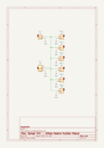
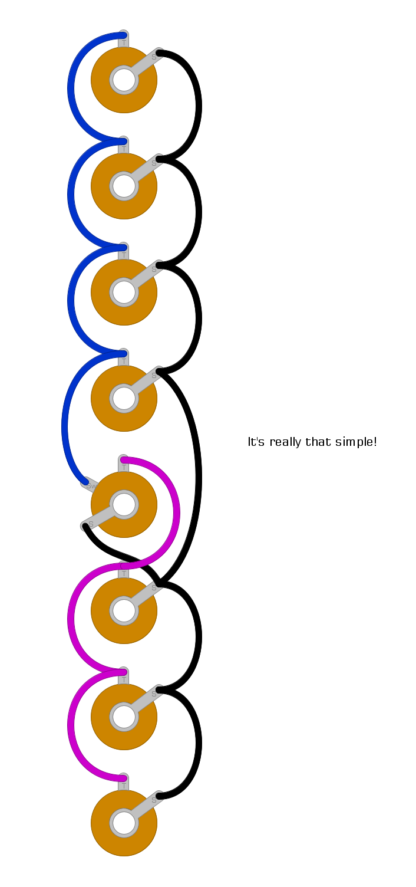

# "spread thin" - simple 1x 1-6/2x 1-3 passive multiple module

## description

simple passive multiple inspired by
[the one available from rakit](https://www.rakits.co.uk/product/passive-multiple-kit/).

inputs are on sockets 1 and 5. it'll work differently depending on which inputs are used:
- socket 1 plugged = 1x 1-6
- socket 1 and socket 5 plugged = 2x 1-3

## schematics

### circuit diagram

### stripboard layout

### bill of materials
<table cellspacing="0" border="1">
  <tr>
    <th>Name</th>
    <th>Value</th>
    <th>Quantity</th>
    <th>Notes</th>
  </tr>
  <tr>
    <td>J1, J2, J3, J4, J6, J7, J8</td>
    <td>3.5mm mono jack socket</td>
    <td>7</td>
    <td></td>
  </tr>
  <tr>
    <td>J5</td>
    <td>3.5mm mono jack socket (switched)</td>
    <td>1</td>
    <td></td>
  </tr>
</table>
