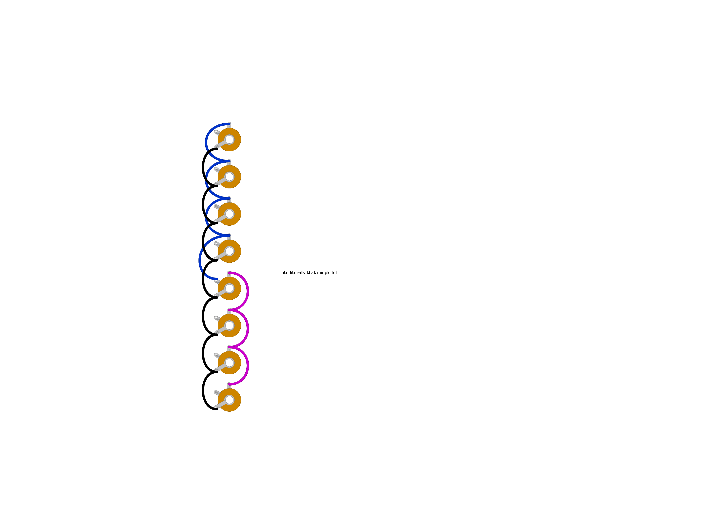

# "spread thin" - simple 1x 1-6/2x 1-3 passive multiple module

## description

todo

## schematics

### passive multiple module

### bill of materials
<table cellspacing="0" border="1">
  <tr>
    <th>Name</th>
    <th>Value</th>
    <th>Quantity</th>
    <th>Notes</th>
  </tr>
  <tr>
    <td>J1, J2, J3, J4, J6, J7, J8</td>
    <td>3.5mm mono jack socket</td>
    <td>7</td>
    <td></td>
  </tr>
  <tr>
    <td>J5</td>
    <td>3.5mm mono jack socket (switched)</td>
    <td>1</td>
    <td></td>
  </tr>
</table>
