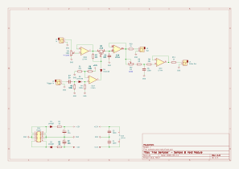
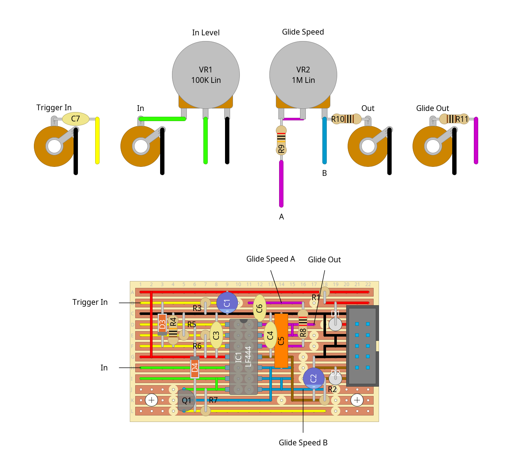

# "free samples" - sample & hold module

a fairly simple sample & hold module with adjustable "glide" output

not too much to say about this one. it's pretty much just [moritz klein's sample & hold design](https://www.youtube.com/watch?v=kIJqzkRe4do), but with adjustments and glide output based on the [mfos sample & hold design](https://musicfromouterspace.com/analogsynth_new/SMPLANDHOLD200607/SMPLANDHOLD200607.php). and by "adjustments" i mostly mean i used an lf444 rather than a tl074 as the input bias current of the latter was too high, causing sampled voltages to drift within seconds. the lf444's input bias current is super low, so i can use an even smaller capacitor for better sampling accuracy and it'll still hold the signal steady for upwards of 20 seconds. its just a shame that it costs like 3x as much as a tl074 :/

if i was gonna build this again i'd probably tweak the values of C6 and VR2 to make the max glide/slew/portamento/whatever time longer. as is, it caps out at around a second. but other than that it all works great, i've been having a lot of fun shoving lfo and noise outputs into it to get arpeggios and random notes out of it.

## schematics

### circuit diagram

### stripboard layout

### bill of materials
<table cellspacing="0" border="1">
  <tr>
    <th>Name</th>
    <th>Value</th>
    <th>Quantity</th>
    <th>Notes</th>
  </tr>
  <tr>
    <td>Vero Board</td>
    <td>22 columns x 12 rows</td>
    <td>1</td>
    <td></td>
  </tr>
  <tr>
    <td>C1, C2</td>
    <td>10uF 50V electrolytic capacitors</td>
    <td>2</td>
    <td></td>
  </tr>
  <tr>
    <td>C3, C4, C6</td>
    <td>100nF 50V ceramic capacitors</td>
    <td>3</td>
    <td></td>
  </tr>
  <tr>
    <td>C5</td>
    <td>10nF 100V polypropylene film capacitor</td>
    <td>1</td>
    <td></td>
  </tr>
  <tr>
    <td>C7</td>
    <td>1nF 50V ceramic capacitor</td>
    <td>1</td>
    <td></td>
  </tr>
  <tr>
    <td>D1, D2</td>
    <td>1N4007 rectifier diodes</td>
    <td>2</td>
    <td></td>
  </tr>
  <tr>
    <td>D3, D4</td>
    <td>1N4148 signal diodes</td>
    <td>2</td>
    <td></td>
  </tr>
  <tr>
    <td>IC1</td>
    <td>LF444 quad op-amp</td>
    <td>2</td>
    <td></td>
  </tr>
  <tr>
    <td>J1, J2, J3, J4</td>
    <td>3.5mm mono jack sockets</td>
    <td>4</td>
    <td></td>
  </tr>
  <tr>
    <td>PH1</td>
    <td>10 pin IDC socket</td>
    <td>1</td>
    <td></td>
  </tr>
  <tr>
    <td>Q1</td>
    <td>J113 n-channel JFET</td>
    <td>1</td>
    <td></td>
  </tr>
  <tr>
    <td>R1, R2</td>
    <td>10Ω 0.25W resistors</td>
    <td>2</td>
    <td></td>
  </tr>
  <tr>
    <td>R3, R4, R6</td>
    <td>100K 0.25W resistors</td>
    <td>3</td>
    <td></td>
  </tr>
  <tr>
    <td>R5</td>
    <td>33K 0.25W resistor</td>
    <td>1</td>
    <td></td>
  </tr>
  <tr>
    <td>R7</td>
    <td>1M 0.25W resistor</td>
    <td>1</td>
    <td></td>
  </tr>
  <tr>
    <td>R8</td>
    <td>20K 0.25W resistor</td>
    <td>1</td>
    <td></td>
  </tr>
  <tr>
    <td>R9</td>
    <td>20Ω 0.25W resistor</td>
    <td>1</td>
    <td></td>
  </tr>
  <tr>
    <td>R10, R11</td>
    <td>1K 0.25W resistors</td>
    <td>2</td>
    <td></td>
  </tr>
  <tr>
    <td>VR1</td>
    <td>100K linear potentiometer</td>
    <td>1</td>
    <td></td>
  </tr>
  <tr>
    <td>VR2</td>
    <td>1M linear potentiometer</td>
    <td>1</td>
    <td></td>
  </tr>
</table>
